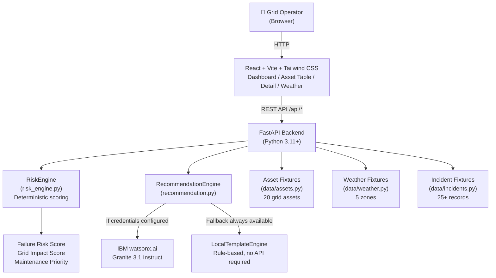

# Architecture

## System Architecture



## Components

| Component | Technology | Responsibility |
|---|---|---|
| Frontend Dashboard | React 18 + Vite 8 + Tailwind CSS 4 | Operations UI: KPI cards, asset table, sensor panels, risk charts, AI advisory display |
| API Server | FastAPI 0.111 + Uvicorn | REST API, CORS, request routing, data aggregation |
| Risk Engine | Pure Python 3.11 | Deterministic failure risk and grid impact scoring using weighted formulas |
| Recommendation Engine | Python + ibm-watsonx-ai SDK | AI advisory generation via watsonx.ai or local rule engine fallback |
| Asset Data | Python fixtures (data/assets.py) | 20 representative grid assets with sensor readings and impact data |
| Weather Data | Python fixtures (data/weather.py) | 5 geographic zone weather conditions (mock, API-ready) |
| Incident Data | Python fixtures (data/incidents.py) | 25+ historical failure/maintenance records |

## Risk Score Methodology

All scores are 0–1, computed deterministically. No ML models used for scoring.

```
sensor_risk = 0.28×temp_score + 0.22×oil_score + 0.20×load_score
            + 0.15×vibration_score + 0.10×discharge_score + 0.05×sf6_score

weather_risk = 0.35×storm_probability + 0.25×wind_score
             + 0.18×temp_extreme + 0.12×precipitation_score + 0.10×lightning

history_risk = 0.40×recency_score + 0.35×frequency_score + 0.25×severity_score

failure_risk = 0.50×sensor_risk + 0.30×weather_risk + 0.20×history_risk + age_modifier

grid_impact  = 0.40×customer_score + 0.25×tier_score
             + 0.20×critical_infra_bonus + 0.15×load_score

maintenance_priority = failure_risk × grid_impact × 100  (0–100 scale)
```

**Status thresholds:**
- `critical`: priority ≥ 38 OR failure_risk ≥ 0.65
- `warning`:  priority ≥ 22 OR failure_risk ≥ 0.40
- `healthy`:  everything else

## Data Flow

1. Operator opens the browser — React app loads and calls `GET /api/dashboard`
2. Backend computes scores for all 20 assets using `score_all_assets()` (cached after first call)
3. Dashboard displays KPI summary: status counts, predicted failures, customers at risk, grid risk level
4. Operator clicks "Asset Risk" → `GET /api/assets` returns all assets ranked by `maintenance_priority`
5. Operator selects TX-013 (highest priority) → `GET /api/assets/TX-013` returns full asset detail
6. Frontend renders sensor gauges, risk breakdown bar chart, sensor radar chart
7. Frontend also fetches `GET /api/weather/ZONE_CENTRAL` and `GET /api/incidents?asset_id=TX-013`
8. Operator clicks "Generate Recommendation" → `GET /api/recommendations/TX-013`
9. Backend builds prompt with all asset context and calls IBM watsonx.ai (or local fallback)
10. Frontend renders structured advisory: urgency, risk summary, contributing factors, action, crew positioning

## Security Considerations

- API keys and credentials stored in `.env` files — never committed to git (enforced by `.gitignore`)
- No authentication on the API for MVP (intended for internal utility network use)
- `src/.env.example` contains only placeholder values — no real credentials in repository
- CORS restricted to configured origins via `CORS_ORIGINS` environment variable

## Scalability Notes (Post-Hackathon)

- The FastAPI backend is stateless and horizontally scalable. Replace Python fixture data with calls to a real-time SCADA/historian API (e.g., OSIsoft PI, GE Predix) without changing the scoring engine interface.
- Weather fixtures can be replaced with NOAA API or IBM Environmental Intelligence Suite calls by implementing the same dict structure.
- The risk engine weights are constants — they can be tuned per utility using historical failure data as training labels.
- A PostgreSQL or TimescaleDB layer can be added for sensor time-series storage without architectural changes.
